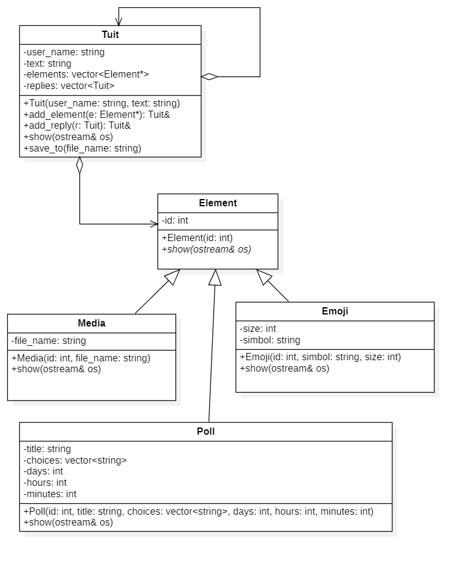

# Task #2: Tuit  
**course:** Programación III  
**unit:** 1  
**cmake project:** prog3_unit1_tuit_v2023_1
## Instructions
Subir a gradescope los siguientes archivos:
- `tuit.cpp`
- `tuit.h`

## Question #1 - (20 points)
  
En el presente ejercicio se tratará de implementar una versión libre y simplificada del modelo de objetos del aplicativo twitter:


El modelo deberá contar con las características descritas en el diagrama, ademas deben de sobrecargase los
 operadores `>>` y `<<` en todas las clases.

**Use Case #1: Leer un archivo**
```c++
Tuit tuit;
tuit.load("file1.txt");
cout << tuit;
```

**Use Case #2: Leer de un archivo**
```c++
Tuit tuit;
ifstream in("file2.txt");
in >> tuit;
cout << tuit;
```

**Use Case #3: Grabar en un archivo**
```c++
Tuit tuit;
ifstream in("file3.txt");
archivo >> tuit;
ofstream out("file4.txt");
out << tuit;
```

**Use Case #4: grabar en un archivo **
```c++
Tuit tuit1("Juan Perez", "Este es un tuit de prueba");
tuit1
    .add_element(new Emoji(1, ":)", 1))
    .add_element(new Media(2, "imagen1.png"));

Tuit tuit2 ("Maria Diaz", "Respuesta a primer tuit");
tuit2
    .add_element(new Emoji(1, "<3", 1));

Tuit tuit3 ("Pedro Ramos", "Segunda respuesta del tuit");
tuit3
    .add_element(new Emoji(1, ":))", 1))
    .add_element(new Poll(2, "Seleccione la opcion",
        {"Opcion A",
         "Opcion B",
         "Opcion C"}, 1, 0, 0));
tuit1
    .reply(tuit2)
    .reply(tuit3);

tuit1
    .save("file5.txt")
```

**Use Case #5: mostrar tuit y su thread**
```c++
Tuit tuit1("JuanPerez", "Este es un tuit de prueba");
tuit1
    .add_element(new Emoji(1, ":)", 1))
    .add_element(new Media(2, "imagen1.png"));

Tuit tuit2 ("MariaDiaz", "Respuesta a primer tuit");
tuit2
    .add_element(new Emoji(1, "<3", 1));

Tuit tuit3 ("PedroRamos", "Segunda respuesta del tuit");
tuit3
    .add_element(new Emoji(1, ":))", 1))
    .add_element(new Poll(2, "Seleccione la opcion",
        {"Opcion A",
         "Opcion B",
         "Opcion C"}, 1, 0, 0));
tuit1
    .reply(tuit2)
    .reply(tuit3);

tuit1
    .show(cout)
```

## Estructura de archivos
```
Tuit|JuanPerez|Este es un tuit de prueba
Emoji|1|:)|1
Media|2|imagen1.png
Tuit|MariaDiaz|Respuesta a primer tuit
Emoji|1|<3|1
Tuit|PedroRamos|Respuesta a primer tuit
Emoji|1|:))|1
Poll|2|Seleccionar opcion|Opcion A,Opcion B,Opcion C|1|0|0
```

## Estructura del resultado de show
```
====================
@JuanPerez
Este es un tuit de prueba
--------------------
:)
imagen1.png
====================
@MariaDiaz
Respuesta a primer tuit
--------------------
<3
====================
@PedroRamos
Respuesta a primer tuit
--------------------
:))
title : Seleccionar opcion
- Opcion A
- Opcion B
- Opcion C
```